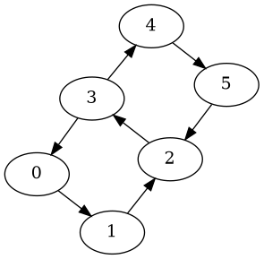
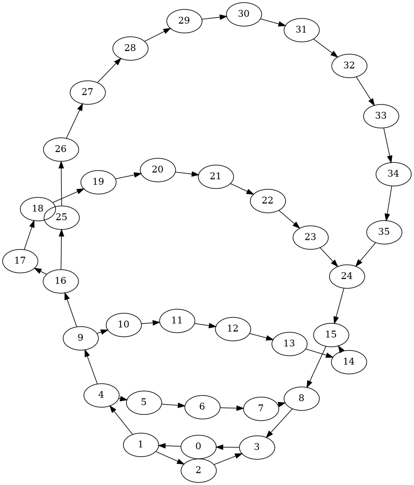
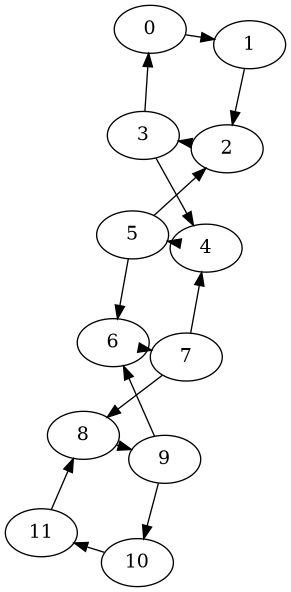
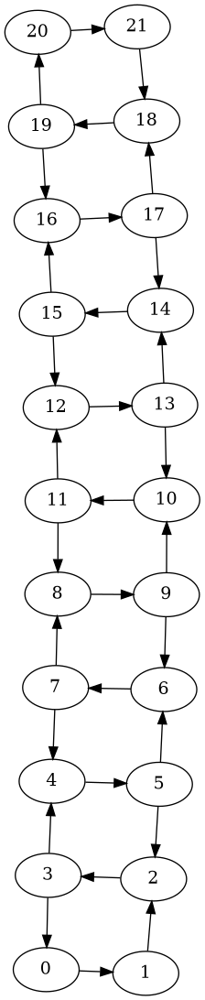

# Generator
Soubor `wannabe_graph_generator.cpp` obsahuje generátor orientovaných grafů plných cyklů, slibený na cvičení.
Použití je
```
./generator typ cislo
```
`typ` je `ladder` nebo `square`, `cislo` je pocet "čtverečků" v grafu.
Výstup je graf vypsaný jako seznam dvojic na standardní výstup.
Předpokládané použití je přesměrování výstupu do souboru:
```
./generator square 2 > square2.txt
```

Naivni skriptik `graph_plot.py` umi načíst vygenerovaný graf a pomocí Networkx a graphviz ho vykreslit a uložit.
Na ilustračních obrázcích níže je vidět, že vykreslovat grafy není trivální záležitost.

## Výstupy square



## Výstupy ladder


